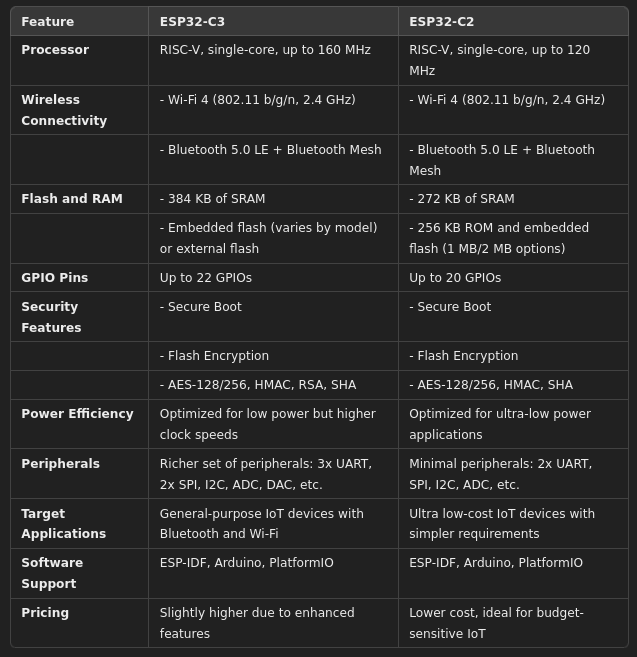

# esp32play
playground

* https://products.espressif.com/#/

# SW

## ide
* can program the ESP32 in the Arduino style.
* Compatible with MicroPython
* Espressif IDF

# HW

## C

ESP32-C series targets simpler IoT projects where low-power performance is essential, such as battery-powered sensors or beacons

## S

ESP32-S feature advanced hardware security features  / **S3**: Adds machine learning acceleration, ideal for lightweight ML applications on edge devices
		S2 - low power single core 
		S3 - dual core AI / ML 

## H

**ESP32-H2** series incorporates Wi-Fi and IEEE 802.15.4, supporting Zigbee and Thread, making it perfect for mesh networking.

## U

ESP32-U series variants focus on maximizing battery life, making them suitable for wearables and remote sensors.