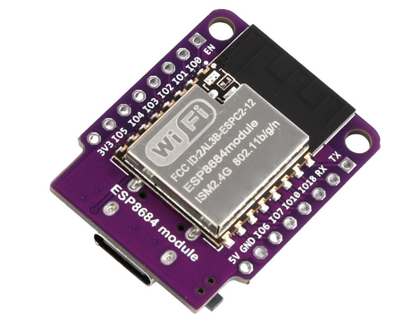

# ESP8684 ESP32-C2 Devkit Mini 

32-bit RISC-V single-core processor up to 120 MHz with 272 KB of SRAM (16 KB dedicated to cache) and 576 KB of ROM storage

Offers advanced sleep modes to reduce power consumption, suitable for battery-powered devices