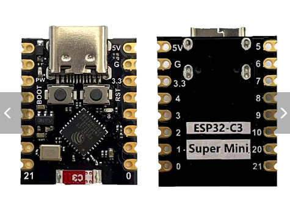

# esp32 c3 super mini

The ESP32 C3 SuperMini is an loT mini development board based on the Espressif ESP32-C3 WiFi/Bluetoot hdual-mode chip. The ESP32-C3 is a 32-bit RISC-V CPU that contains the FPU (floating
point unit) for32-bit single-precision operations with powerful computing power.