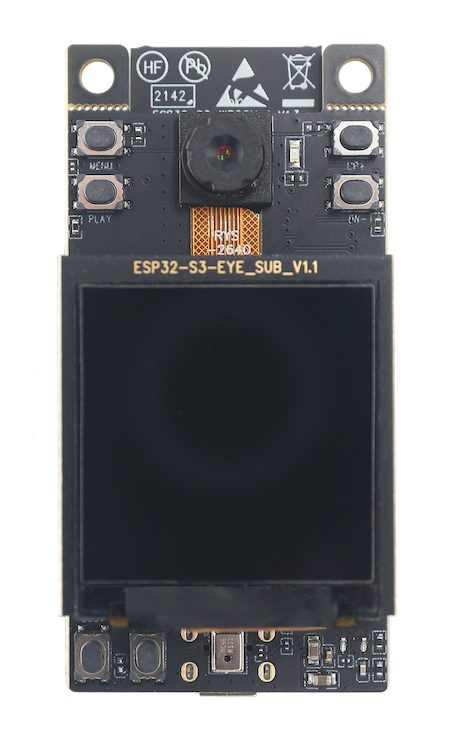
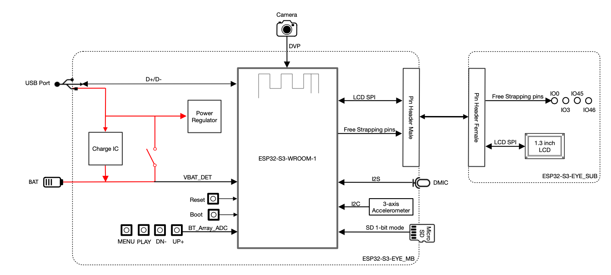
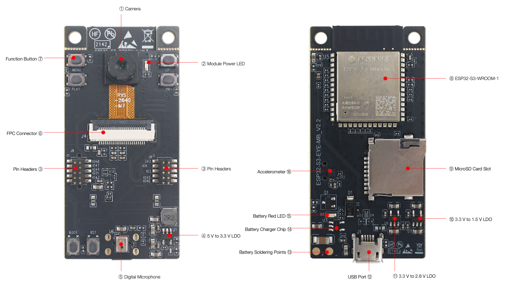

# esp 32 s3 eye

* v2.2  produced by Espressif. It is based on the ESP32-S3 SoC and ESP-WHO

```
main board ESP32-S3-EYE-MB that integrates the ESP32-S3-WROOM-1 
the sub board (ESP32-S3-EYE-SUB) that contains an LCD display. 
```




```
8 MB Octal PSRAM 
8 MB flash

Wi-Fi 

debugging through a Micro-USB port

```





What is ESP eye?
ESP-EYE is a development board for image recognition and audio processing, which can be used in various AIoT applications. It features an ESP32 chip, a 2-Megapixel camera and a microphone.



The ESP32-S3-EYE is an AI-powered development board from Espressif, featuring the ESP32-S3 microcontroller with integrated Wi-Fi and Bluetooth. It is specifically designed for computer vision and audio-based AI applications at the edge.
Key Features:

    ESP32-S3 MCU: Dual-core Xtensa LX7 with vector processing for AI/ML workloads.
    Onboard 2MP Camera (OV2640): Optimized for image recognition, face detection, and other vision tasks.
    Microphone (PDM): Supports wake word detection and voice-based AI.
    USB-C & Battery Support: Can run standalone with low-power modes.
    8MB PSRAM & 8MB Flash: Sufficient for AI models and buffering.
    Compact Size: Ideal for IoT, surveillance, and AIoT applications.

Why It’s Useful for Embedded Edge AI:

    Low-Power AI Vision – Runs basic face recognition, object detection, and image classification without needing cloud processing.
    Voice & Audio AI – Can integrate wake-word detection, keyword spotting, and basic speech processing.
    Standalone Edge AI – Works independently with Wi-Fi/BLE connectivity, reducing the need for external processing.
    Rapid Prototyping – Works with ESP-IDF, TensorFlow Lite, and Edge Impulse for quick AI deployments.
    Battery-Powered – Can run from a battery, making it ideal for wearables, security, and portable AI devices.

For an embedded edge engineer, this is a low-cost, efficient AI dev board that lets you experiment with lightweight ML models, vision applications, and IoT-based AI deployments without a dedicated NPU/GPU.

Enhances object detection, face recognition, and keyword spotting without an external AI accelerator.

## hw

Dual-core architecture: Two Xtensa LX7 cores running at up to 240 MHz, providing parallel processing for multi-threaded tasks

includes vector processing extensions (SIMD - Single Instruction Multiple Data), significantly improving AI/ML inference speed by processing multiple data elements in parallel.

Can process multiple pixels, audio samples, or matrix elements in one instruction cycle.

Useful for convolution, matrix multiplications, and Fourier transforms, which are fundamental to AI workloads.

Built-in hardware acceleration for int8 and float16 computations.

