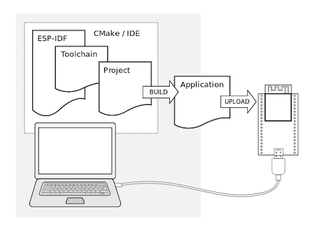

# dev tools

* dev host:

```
sudo usermod -a -G dialout $USER

```

## ESP-IDF
* common framework to develop applications for ESP32-S3




```
sudo apt-get install git wget flex bison gperf python3 python3-pip python3-venv cmake ninja-build ccache libffi-dev libssl-dev dfu-util libusb-1.0-0

mkdir -p ./esp-idf
cd ./esp-idf
git clone -b v5.4 --recursive https://github.com/espressif/esp-idf.git .
export IDF_TOOLS_PATH="/home/user/proj/s3eye/esp/idf_tools_path"
./install.sh esp32s3
. ./export.sh


### ./install.sh all  for all boards;


```

## ESP-WHO
* image processing platform that runs on ESP-IDF

```
git clone https://github.com/espressif/esp-who.git
```
