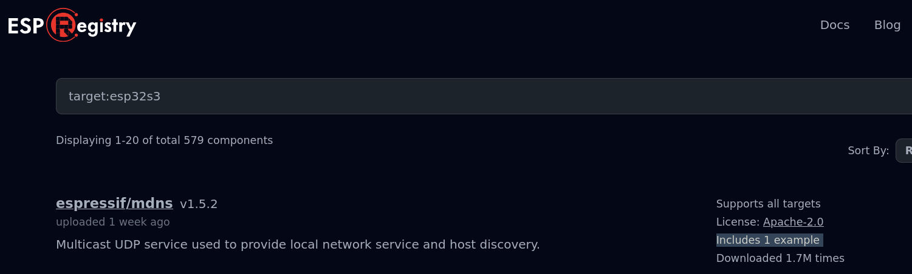

# create-project-from-example

Some components in the ESP Component Registry contain example projects. To create a new project from an example you can run the command idf.py create-project-from-example EXAMPLE. The EXAMPLE argument should be in the format namespace/name=1.0.0:example where namespace/name is the name of the component, =1.0.0 is a version range of the component


look for examples on the registry




```

idf.py create-project-from-example "espressif/usb_stream=1.5.0:usb_camera_lcd_display" 
cd usb_camera_lcd_display/

idf.py set-target esp32s3

idf.py build

idf.py flash

```